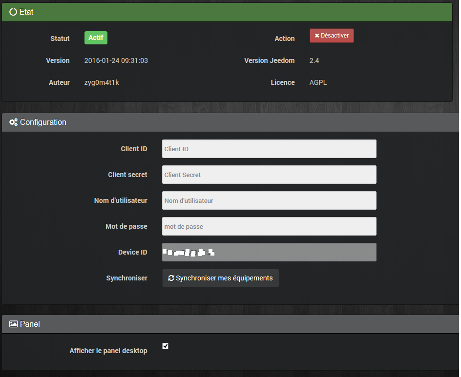
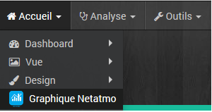
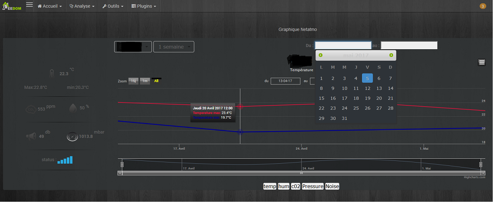

== Plugin Graphs

Présentation
===

Ce plugin permet de générer des graphiques des sondes Netatmo

Configuration
===

Il faut télécharger le plugin sur le market. 

Après l'avoir activer il faut ensuite aller dans Plugins/Gestions des plugins et cliquer sur l'icône du plugin

Remplir les champs selon vos informations et sauvegarder.

Cocher activer le panel et enregistrer.

Pour voir les informations.

image::../images/netatmo1.png[align="center"]

Et ainsi visualiser les données Netatmo sous forme de graphique

> **NOTE**
>
>Le thème du graph est celui que vous avez choisi dans votre profil.
>
>Le plugin ne crée pas de commandes.